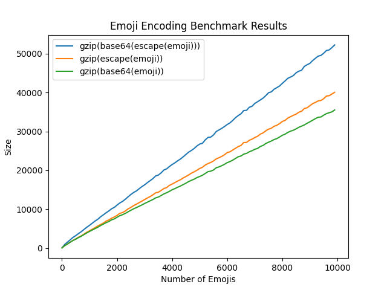

how it started:


what happened next:


\*lots of struggling ensued\*

eventually:



---

use pyenv or whatever

```
# should be 3.9.6
python --version

# if it's not? or just to be safe
pyenv local

. env/bin/activate
```

install

```
pip install -r requirements.txt
```

run

```
python bench.py
```

print out the octets and the base64

```
DEBUG=1 python bench.py
```
